# Architettura Spark + Kafka in CineMatch

## Panoramica

CineMatch utilizza **Apache Kafka** come message broker e **Apache Spark Structured Streaming** per l'elaborazione real-time delle statistiche utente e dei trend globali della community.

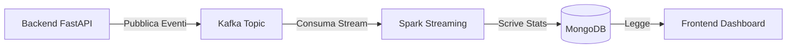

---

## Perché Kafka + Spark?

### Problema
Quando un utente aggiorna la watchlist, le statistiche devono essere ricalcolate. Farlo sincronamente:
- **Blocca la risposta API** (latenza alta)
- **Non scala** con migliaia di utenti
- **Crea accoppiamento** tra business logic e analytics

### Soluzione
Con Kafka + Spark:
- ✅ Latenza API <50ms
- ✅ Scalabilità orizzontale
- ✅ Persistenza eventi
- ✅ Elaborazione real-time

---

## Architettura Dual-Stream

Il processore esegue **2 stream paralleli** dalla stessa sorgente Kafka:

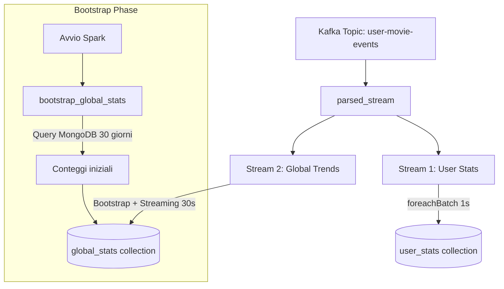

---

## Funzioni Principali

### `normalize_title(text: str) -> str`
Normalizza i titoli dei film per matching fuzzy:
- Rimuove accenti (è → e, ñ → n)
- Converte caratteri speciali (ß → ss, æ → ae)
- Lowercase e rimuove punteggiatura

```python
normalize_title("Città d'Ombra") → "citta d ombra"
```

---

### `create_spark_session() -> SparkSession`
Crea e configura la sessione Spark con:
- Connettore Kafka (`spark-sql-kafka`)
- Connettore MongoDB (`mongo-spark-connector`)
- Checkpoint location per fault-tolerance

---

### `bootstrap_global_stats()`
**Fase di bootstrap** eseguita UNA VOLTA all'avvio di Spark.

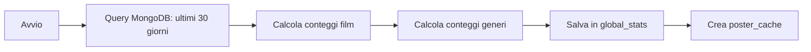

**Output in MongoDB:**
```javascript
{
  "type": "global_trends",
  "top_movies": [...],
  "trending_genres": [...],
  "movie_counts": {"Batman": 101, "Inception": 85, ...},
  "genre_counts": {"Action": 500, "Drama": 450, ...},
  "poster_cache": {"Batman": "https://...", ...},
  "source": "bootstrap"
}
```

**Perché è necessario?**
Lo streaming Spark parte da zero e non vede i dati storici. Il bootstrap fornisce lo stato iniziale leggendo MongoDB.

---

### `write_global_trends_to_mongo(batch_df, batch_id)`
**Callback dello streaming** chiamata ogni 30 secondi.

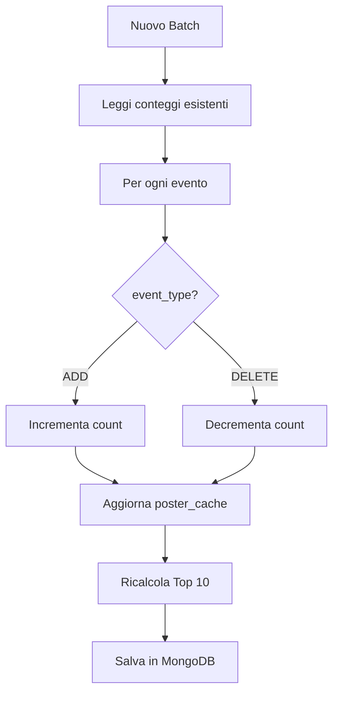

**Gestione ADD vs DELETE:**
```python
if 'DELETE' in event_type:
    movie_counts[title] = max(0, old_count - delta)
    if movie_counts[title] == 0:
        del movie_counts[title]  # Rimuovi dal ranking
else:
    movie_counts[title] = old_count + delta
```

**Poster Cache:**
I poster URL vengono salvati in `poster_cache` per evitare di perderli tra batch successivi.

---

### `start_global_trends_stream(spark, parsed_stream)`
Configura e avvia lo stream Structured Streaming per i trend globali.

**Configurazione:**
| Parametro | Valore | Descrizione |
|-----------|--------|-------------|
| Watermark | 1 ora | Accetta eventi in ritardo fino a 1h |
| Trigger | 30 secondi | Frequenza elaborazione batch |
| Output Mode | update | Emette solo righe cambiate |

**Aggregazione:**
```python
aggregated = watermarked \
    .groupBy(col("movie_name"), col("event_type")) \
    .agg(spark_count("*").alias("watch_count"))
```

---

### `process_batch(batch_df, batch_id)`
Elabora le **statistiche utente** (Stream 1).

Per ogni micro-batch:
1. Raggruppa eventi per `user_id`
2. Chiama `process_partition` in parallelo sui worker
3. Ogni partizione scrive direttamente su MongoDB

---

### `process_partition(iterator)`
Funzione eseguita sui **worker Spark** (non sul driver).

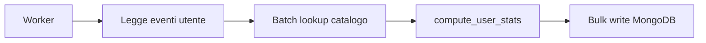

**Ottimizzazioni:**
- Query batch con `$in` invece di query singole
- PyMongo connection pool per worker
- Bulk write operations

---

### `compute_user_stats(movies, catalog_collection, prefetched_map)`
Calcola le statistiche complete per un singolo utente.

**Output:**
```python
{
    "total_watched": 150,
    "avg_rating": 7.5,
    "rating_chart_data": [...],
    "top_rated_movies": [...],
    "recent_movies": [...],
    "genre_data": [...],
    "favorite_genre": "Action",
    "watch_time_hours": 250,
    "best_rated_directors": {...},
    "most_watched_actors": [...],
    "stats_version": "3.2"
}
```

---

## Schema MongoDB

### `global_stats` Collection

Questo documento contiene sia i **dati per il frontend** che lo **stato interno per lo streaming**.

```javascript
{
  "_id": ObjectId(...),
  "type": "global_trends",
  
  // ═══════════════════════════════════════════════════════════
  // OUTPUT: Dati consumati dal Frontend
  // ═══════════════════════════════════════════════════════════
  "top_movies": [
    {"title": "Batman", "poster_path": "https://...", "count": 101}
  ],
  "trending_genres": [
    {"genre": "Action", "count": 500, "percentage": 25.5}
  ],
  
  // ═══════════════════════════════════════════════════════════
  // STATO INTERNO: Usato solo da Spark Streaming
  // ═══════════════════════════════════════════════════════════
  "movie_counts": {"Batman": 101, "Inception": 85, ...},
  "genre_counts": {"Action": 500, "Drama": 450, ...},
  "poster_cache": {"Batman": "https://...", ...},
  
  // ═══════════════════════════════════════════════════════════
  // METADATA
  // ═══════════════════════════════════════════════════════════
  "updated_at": "2026-01-19T14:10:00+01:00",
  "total_movies_analyzed": 8644,
  "source": "streaming_incremental" | "bootstrap"
}
```

---

### Perché questi campi interni?

#### Il problema: Streaming senza ri-leggere MongoDB

Quando arriva un evento Kafka:
```
Evento: { user: "Mario", movie: "Batman", action: "ADD" }
```

**NON vogliamo** fare:
```python
# ❌ LENTO - Query su milioni di record
all_movies = db.movies.find({})
counts = count_all_movies(all_movies)
```

**Vogliamo** fare:
```python
# ✅ VELOCE - Solo +1 o -1
movie_counts["Batman"] += 1
```

---

#### `movie_counts` - Stato dei conteggi

Contiene **TUTTI** i conteggi film, non solo i top 10.

```javascript
movie_counts: {
    "Batman": 101,      // Nel top 10
    "Cleopatra": 83,    // Nel top 10
    "Inception": 57,    // Nel top 10
    "Film Sconosciuto": 2,  // NON nel top 10, ma tracciato
    // ... altri migliaia di film
}
```

**Chi lo usa:** Solo Spark Streaming (interno)
**Perché serve:** Per fare `+1` o `-1` senza rileggere MongoDB

---

#### `genre_counts` - Stato dei generi

Stessa logica di `movie_counts` ma per i generi.

```javascript
genre_counts: {
    "Action": 500,
    "Drama": 450,
    "Comedy": 380,
    // ... tutti i generi
}
```

**Chi lo usa:** Solo Spark Streaming (interno)
**Perché serve:** Per aggiornare le percentuali dei generi incrementalmente

---

#### `poster_cache` - Cache delle copertine

Questo è il campo più "strano". Ecco perché serve:

**Scenario passo-passo:**

1. **Batch 1**: Arriva evento `ADD Batman` (prima volta)
   - `movie_counts["Batman"]` era 0 → ora è 1
   - Cerco nel catalogo MongoDB → trovo poster
   - Salvo in `poster_cache["Batman"] = "https://..."`

2. **Batch 2**: Arriva evento `ADD Batman` (seconda volta)
   - `movie_counts["Batman"]` era 1 → ora è 2
   - **NON cerco nel catalogo** (già fatto!)
   - Faccio solo `+1`

3. **Batch 100**: Batman entra nel Top 10
   - Devo mostrare Batman con poster in `top_movies`
   - Ma in QUESTO batch non c'era nessun evento per Batman
   - **Senza cache:** poster = null ❌
   - **Con cache:** leggo `poster_cache["Batman"]` ✅

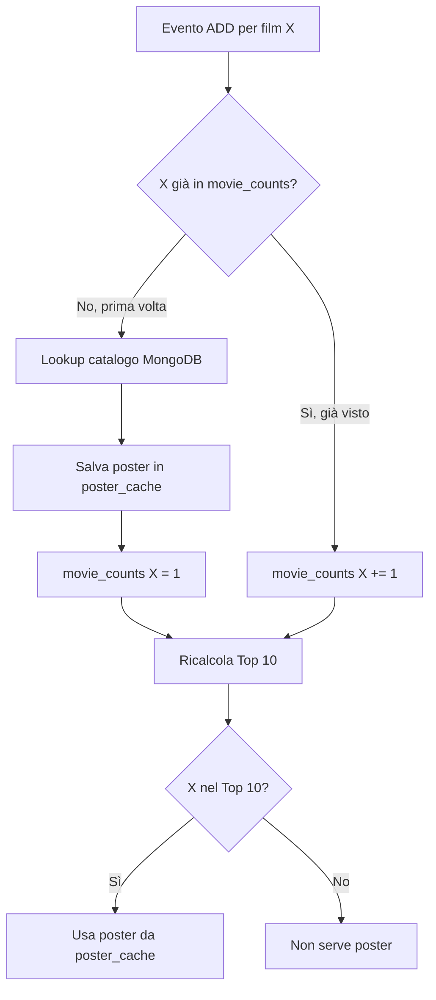

**Chi lo usa:** Solo Spark Streaming (interno)
**Perché serve:** Per non perdere i poster dei film che entrano nel Top 10 in batch successivi

---

### Tabella Riepilogo Campi

| Campo | Tipo | Chi lo usa | Scopo |
|-------|------|------------|-------|
| `top_movies` | Array[10] | **Frontend** | Mostra i 10 film più visti |
| `trending_genres` | Array[10] | **Frontend** | Mostra i 10 generi di tendenza |
| `movie_counts` | Object | Spark | Stato per +1/-1 senza query |
| `genre_counts` | Object | Spark | Stato generi per +1/-1 |
| `poster_cache` | Object | Spark | Cache poster per film futuri top 10 |
| `updated_at` | String | Entrambi | Timestamp ultimo aggiornamento |
| `source` | String | Debug | "bootstrap" o "streaming_incremental" |
| `total_movies_analyzed` | Number | Info | Quanti film analizzati nel bootstrap |
```

### `user_stats` Collection
```javascript
{
  "_id": ObjectId(...),
  "user_id": "user123",
  "stats": {
    "total_watched": 150,
    "avg_rating": 7.5,
    // ... altre statistiche
  },
  "last_updated": "2026-01-19T14:10:00+01:00"
}
```

---

## Configurazione Docker

```yaml
spark-stats-processor:
  image: apache/spark:3.4.0
  environment:
    - KAFKA_BOOTSTRAP_SERVERS=kafka:29092
    - MONGODB_URL=mongodb://mongodb:27017
  volumes:
    - spark_checkpoints:/tmp/spark-checkpoints
```

**Variabili d'ambiente:**
| Variabile | Default | Descrizione |
|-----------|---------|-------------|
| `KAFKA_BOOTSTRAP_SERVERS` | `kafka:29092` | Broker Kafka |
| `MONGODB_URL` | `mongodb://mongodb:27017` | Connection string MongoDB |

---

## Flusso Completo: Aggiunta Film

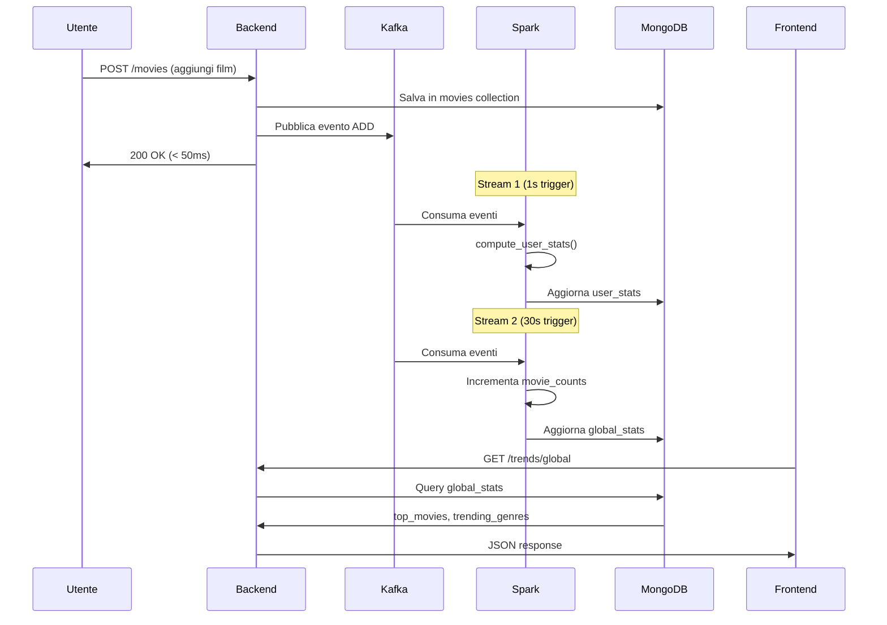

---

## Vantaggi Architettura

| Aspetto | Beneficio |
|---------|-----------|
| **Scalabilità** | Aggiungi worker Spark per più throughput |
| **Disaccoppiamento** | Backend indipendente da analytics |
| **Resilienza** | Kafka persiste eventi, Spark ha checkpoint |
| **Real-time** | Update ogni 30s per global, 1s per user stats |
| **Storico** | Bootstrap legge 30 giorni di dati all'avvio |

---

## Approfondimento: User Stats vs Global Stats

### User Stats: Micro-Batch con Query MongoDB

Le statistiche utente usano un approccio **ibrido** chiamato "micro-batch":

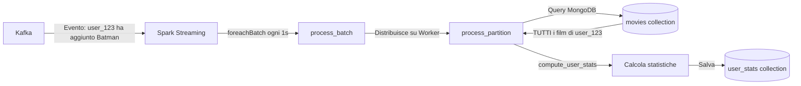

**Cosa fa Spark qui?**
1. **Distribuzione**: Spark distribuisce il lavoro sui worker in parallelo
2. **Trigger**: Ogni 1 secondo raccoglie gli eventi e li processa
3. **NON mantiene stato**: Non usa `movie_counts` incrementali

**Cosa fa MongoDB?**
Ogni volta che arriva un evento per un utente, il worker Spark:
```python
# In process_partition() - eseguito sul WORKER Spark
user_movies = list(db.movies.find({"user_id": user_id}))  # Query TUTTI i film
stats = compute_user_stats(user_movies, ...)  # Ricalcola da zero
db.user_stats.replace_one({"user_id": user_id}, stats)  # Sovrascrive
```

**Perché query MongoDB e non stato Spark?**
Le statistiche utente sono **complesse e interdipendenti**:
- Media rating → richiede TUTTI i rating
- Genere preferito → richiede TUTTI i generi
- Top rated movies → richiede confronto tra TUTTI i film
- Se cancelli 1 film → devi ricalcolare TUTTO

---

### Global Stats: Streaming Incrementale Puro

Le statistiche globali usano **vero streaming incrementale**:

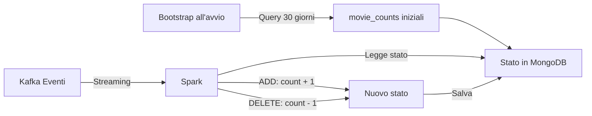

**Cosa fa Spark qui?**
1. **Aggregazione nativa**: `groupBy(movie_name, event_type).count()`
2. **Watermark**: Gestisce eventi in ritardo fino a 1 ora
3. **Stato incrementale**: Somma/sottrae delta, non rilegge mai tutto

**Cosa fa MongoDB?**
Solo storage dello stato. Non viene mai fatta una query su tutti i film.

```python
# In write_global_trends_to_mongo()
existing = db.global_stats.find_one({"type": "global_trends"})
movie_counts = Counter(existing.get("movie_counts", {}))  # Legge stato

for row in rows:
    if event_type == "DELETE":
        movie_counts[title] -= delta  # Decrementa
    else:
        movie_counts[title] += delta  # Incrementa

db.global_stats.update_one(...)  # Salva nuovo stato
```

---

### Confronto Dettagliato

| Aspetto | User Stats | Global Stats |
|---------|-----------|--------------|
| **Pattern** | Micro-batch con ricalcolo | Streaming incrementale |
| **Trigger** | 1 secondo | 30 secondi |
| **Usa Spark per** | Distribuzione lavoro | Aggregazione + Stato |
| **Query MongoDB** | Sì, tutti i film dell'utente | Solo al bootstrap (30 giorni) |
| **Stato mantenuto** | No (ricalcola sempre) | Sì (`movie_counts`, `genre_counts`) |
| **Complessità calcolo** | Alta (medie, top rated, grafici) | Bassa (solo conteggi +/-) |
| **Costo evento ADD** | O(n) dove n = film utente | O(1) |
| **Costo evento DELETE** | O(n) dove n = film utente | O(1) |

---

### Perché due approcci diversi?

**User Stats - Ricalcolo completo:**
- Ogni utente ha ~50-500 film → query veloce (~10ms)
- Le statistiche sono complesse: medie, percentuali, ranking
- Un DELETE richiede comunque ricalcolo (es. nuova media)
- Costo accettabile per singolo utente

**Global Stats - Incrementale:**
- Migliaia di utenti, milioni di eventi potenziali
- Solo conteggi semplici (film visti, generi)
- Incrementare/decrementare è O(1)
- Query completa sarebbe troppo costosa

---

### Quando useremmo streaming puro per User Stats?

Se le statistiche utente fossero solo conteggi semplici:
```python
# Esempio ipotetico - NON implementato
user_stats = {
    "total_watched": 150,  # Incrementabile
    "total_action": 50,    # Incrementabile
    "total_drama": 30      # Incrementabile
}
```

Ma noi calcoliamo:
```python
# Implementazione attuale - richiede TUTTI i dati
user_stats = {
    "avg_rating": sum(ratings) / len(ratings),  # Media
    "top_rated": sorted(movies, key=rating)[:10],  # Top 10
    "favorite_genre": max(genres, key=count),  # Moda
    "best_director": complex_aggregation(...)  # Aggregazione
}
```

Queste metriche **non sono incrementabili** → serve ricalcolo completo.

---

## Come Scalerei per Milioni di Utenti: Lambda Architecture

L'architettura attuale funziona bene per **piccola/media scala** (fino a ~100k utenti). Per scalare a **milioni di utenti** (scenario Netflix/Spotify), adotterei la **Lambda Architecture**.

---

### Il Problema della Scala

| Scala | Utenti | Eventi/giorno | Approccio Attuale | Performance |
|-------|--------|---------------|-------------------|-------------|
| **Piccola** | < 10k | ~50k | ✅ Funziona | < 100ms |
| **Media** | 10k - 100k | ~500k | ⚠️ Accettabile | 100-500ms |
| **Grande** | 100k - 1M | ~5M | ❌ Rallenta | > 1s |
| **Enorme** | > 1M | > 50M | ❌ Non scala | Timeout |

**Perché non scala?**
- Ogni evento utente → query MongoDB per TUTTI i suoi film
- Con utenti "power user" (10k+ film) → query pesanti
- Con milioni di eventi → troppi accessi concorrenti a MongoDB

---

### Soluzione: Lambda Architecture

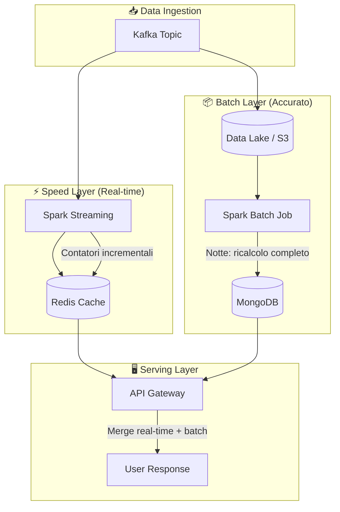

---

### Speed Layer: Statistiche Approssimate in Tempo Reale

Il **Speed Layer** fornisce statistiche immediate ma potenzialmente imprecise.

```python
# Speed Layer - contatori incrementali in Redis
class SpeedLayerProcessor:
    def __init__(self):
        self.redis = Redis(host="redis-cluster", decode_responses=True)
    
    def process_event(self, event):
        user_id = event["user_id"]
        
        if event["type"] == "ADD":
            # Incrementa contatori (O(1) - velocissimo!)
            self.redis.hincrby(f"user:{user_id}:speed", "movie_count", 1)
            self.redis.hincrbyfloat(f"user:{user_id}:speed", "rating_sum", event["rating"])
            self.redis.hincrby(f"user:{user_id}:genres", event["genre"], 1)
            
        elif event["type"] == "DELETE":
            # Decrementa contatori
            self.redis.hincrby(f"user:{user_id}:speed", "movie_count", -1)
            self.redis.hincrbyfloat(f"user:{user_id}:speed", "rating_sum", -event["rating"])
            self.redis.hincrby(f"user:{user_id}:genres", event["genre"], -1)
        
        # Calcola media "live" (approssimata)
        speed_data = self.redis.hgetall(f"user:{user_id}:speed")
        if int(speed_data.get("movie_count", 0)) > 0:
            avg = float(speed_data["rating_sum"]) / int(speed_data["movie_count"])
            self.redis.hset(f"user:{user_id}:speed", "avg_rating_live", avg)
```

**Caratteristiche:**
- ⚡ Latenza: **< 10ms**
- ⚠️ Accuratezza: ~95% (può driftare nel tempo)
- 📊 Statistiche: Solo contatori e medie semplici

---

### Batch Layer: Ricalcolo Completo Notturno

Il **Batch Layer** garantisce accuratezza ricalcolando tutto ogni notte.

```python
# Batch Layer - Job Spark che gira ogni notte (es. 3:00 AM)
def nightly_batch_job():
    spark = SparkSession.builder \
        .appName("UserStatsBatchJob") \
        .config("spark.mongodb.read.connection.uri", MONGO_URI) \
        .getOrCreate()
    
    # 1. Legge TUTTO dal Data Lake (eventi degli ultimi 30 giorni)
    events_df = spark.read.parquet("s3://data-lake/user-events/")
    
    # 2. Legge tutti i film dal catalogo
    movies_df = spark.read.format("mongodb") \
        .option("collection", "movies") \
        .load()
    
    # 3. Join e aggregazione con la potenza di Spark
    user_stats = events_df \
        .join(movies_df, "movie_id") \
        .groupBy("user_id") \
        .agg(
            count("*").alias("total_watched"),
            avg("rating").alias("avg_rating"),
            collect_list(struct("title", "rating")).alias("movies_list"),
            # ... altre aggregazioni complesse
        )
    
    # 4. Calcolo statistiche complesse con UDF
    @udf(returnType=StringType())
    def compute_favorite_genre(movies_list):
        genres = [m.genre for m in movies_list]
        return Counter(genres).most_common(1)[0][0]
    
    user_stats = user_stats.withColumn(
        "favorite_genre", 
        compute_favorite_genre(col("movies_list"))
    )
    
    # 5. Scrivi risultato su MongoDB (sovrascrive)
    user_stats.write.format("mongodb") \
        .option("collection", "user_stats_batch") \
        .mode("overwrite") \
        .save()
    
    # 6. Resetta i contatori Speed Layer in Redis
    reset_speed_layer_deltas()
    
    print(f"✅ Batch job completato: {user_stats.count()} utenti elaborati")
```

**Caratteristiche:**
- 🐢 Latenza: **ore** (job notturno)
- ✅ Accuratezza: **100%** (ricalcolo completo)
- 📊 Statistiche: Tutte, anche le più complesse

---

### Serving Layer: Merge Intelligente

L'API combina i dati dei due layer per dare la risposta migliore.

```python
# Serving Layer - API che unisce Speed + Batch
class UserStatsService:
    def __init__(self):
        self.redis = Redis(host="redis-cluster")
        self.mongo = MongoClient(MONGO_URI)
    
    def get_user_stats(self, user_id: str) -> dict:
        # 1. Leggi statistiche batch (accurate, ma vecchie di max 24h)
        batch_stats = self.mongo.db.user_stats_batch.find_one({"user_id": user_id})
        
        # 2. Leggi delta dal Speed Layer (eventi da ultimo batch)
        speed_delta = self.redis.hgetall(f"user:{user_id}:speed")
        
        # 3. Merge intelligente
        merged_stats = {
            # Contatori: batch + delta speed
            "total_watched": batch_stats["total_watched"] + int(speed_delta.get("movie_count", 0)),
            
            # Media: ricalcola con i delta
            "avg_rating": self._merge_averages(
                batch_avg=batch_stats["avg_rating"],
                batch_count=batch_stats["total_watched"],
                delta_sum=float(speed_delta.get("rating_sum", 0)),
                delta_count=int(speed_delta.get("movie_count", 0))
            ),
            
            # Statistiche complesse: usa batch (troppo costoso calcolare live)
            "top_rated_movies": batch_stats["top_rated_movies"],
            "best_directors": batch_stats["best_directors"],
            
            # Metadata
            "batch_updated_at": batch_stats["updated_at"],
            "realtime_delta_count": int(speed_delta.get("movie_count", 0))
        }
        
        return merged_stats
    
    def _merge_averages(self, batch_avg, batch_count, delta_sum, delta_count):
        """Combina media batch con delta speed layer."""
        if delta_count == 0:
            return batch_avg
        
        total_sum = (batch_avg * batch_count) + delta_sum
        total_count = batch_count + delta_count
        return total_sum / total_count
```

---

### Architettura Completa

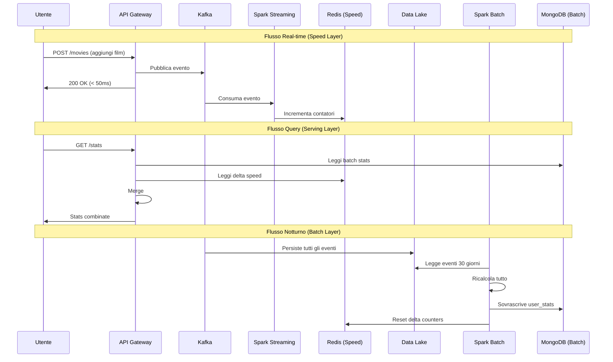

---

### Confronto: Architettura Attuale vs Lambda

| Aspetto | Attuale (Micro-batch) | Lambda Architecture |
|---------|----------------------|---------------------|
| **Complessità** | ⭐⭐ Semplice | ⭐⭐⭐⭐⭐ Complessa |
| **Componenti** | Kafka, Spark, MongoDB | Kafka, Spark×2, Redis, Data Lake, MongoDB |
| **Costo infrastruttura** | €€ | €€€€€ |
| **Latenza real-time** | ~1 secondo | < 10ms |
| **Accuratezza real-time** | 100% | ~95-99% |
| **Scala massima** | ~100k utenti | Milioni di utenti |
| **Recovery da failure** | Checkpoint Spark | Event replay da Data Lake |
| **Team necessario** | 1-2 sviluppatori | Team di data engineering |

---

### Quando Migrare a Lambda?

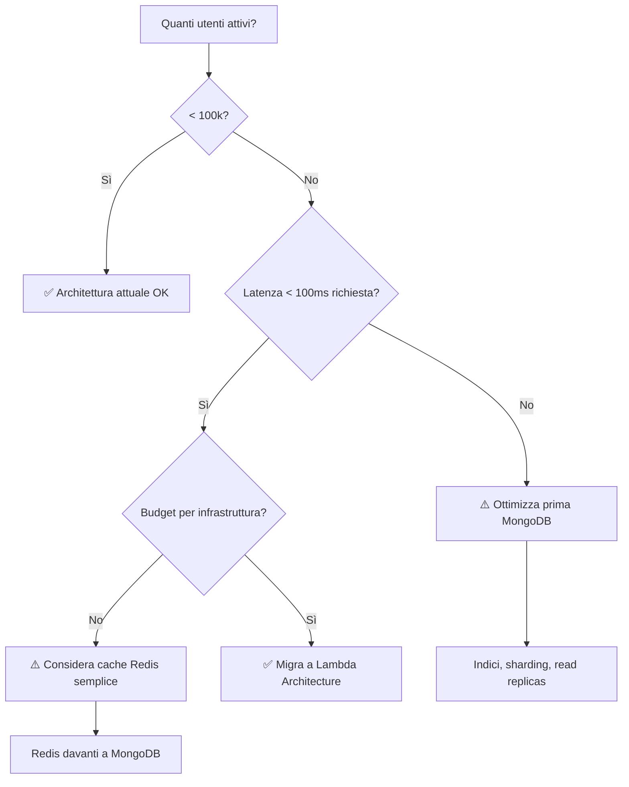

---

### Implementazione Graduale

Se dovessi scalare il progetto attuale, lo farei in **3 fasi**:

#### Fase 1: Aggiungi Cache Redis (Settimane)
```python
# Mantieni architettura attuale, aggiungi cache
def get_user_stats(user_id):
    cached = redis.get(f"stats:{user_id}")
    if cached:
        return json.loads(cached)
    
    stats = compute_from_mongodb(user_id)
    redis.setex(f"stats:{user_id}", 300, json.dumps(stats))  # Cache 5 min
    return stats
```

#### Fase 2: Speed Layer Incrementale (Mesi)
- Aggiungi contatori Redis per statistiche semplici
- Mantieni ricalcolo MongoDB per statistiche complesse
- API fa merge

#### Fase 3: Lambda Completa (Trimestre)
- Aggiungi Data Lake (S3/HDFS)
- Implementa batch job notturno
- Migra query complesse al batch layer

---

### Conclusione

> **Per questo progetto**: L'architettura micro-batch attuale è **la scelta giusta**.
> 
> **Per scalare a produzione**: Evolverei verso Lambda Architecture, ma solo quando i numeri lo richiedono.
> 
> La regola d'oro: **"Premature optimization is the root of all evil"** - Donald Knuth
