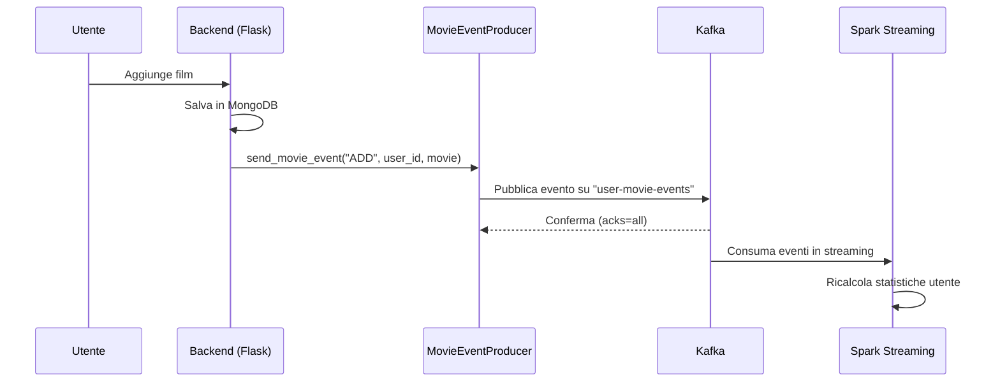
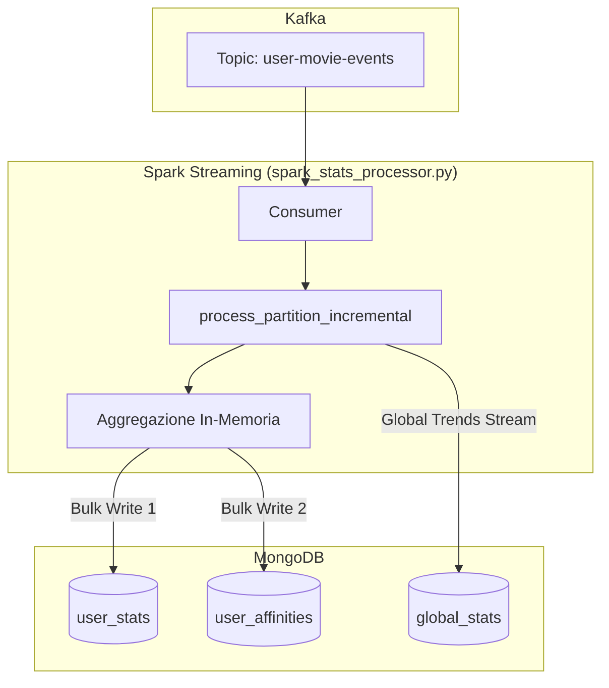

# Spiegazione del Kafka Producer e Integrazione con Spark

Questo documento spiega in dettaglio il funzionamento del file `kafka_producer.py`, che implementa un **producer Kafka** per pubblicare eventi relativi ai film degli utenti, e come questi eventi vengono **consumati da Spark Streaming**.

> [!NOTE]
> Questo documento fa parte di una triade: **Producer** (backend) → **Kafka** (broker) → **Consumer** (Spark). Per una comprensione completa, leggi anche [spiegazione_main.md](file:///c:/Users/lange/Desktop/Esame-Fenza/docs/spiegazione_main.md).

---

## 📋 Panoramica Generale

Il modulo gestisce la **pubblicazione di eventi** su un topic Kafka chiamato `user-movie-events`. Ogni volta che un utente aggiunge, modifica o elimina un film dalla propria lista, viene generato un evento che viene inviato a Kafka per essere successivamente elaborato (tipicamente da Apache Spark).

---

## 🏗️ Struttura del Codice

### Import e Dipendenze

```python
import os
import json
import logging
import pytz
from datetime import datetime
from typing import Optional
from kafka import KafkaProducer
from kafka.errors import KafkaError
```

| Libreria | Scopo |
|----------|-------|
| `os` | Lettura variabili d'ambiente |
| `json` | Serializzazione dei messaggi in formato JSON |
| `logging` | Logging degli eventi e degli errori |
| `pytz` | Gestione del fuso orario (Europe/Rome) |
| `datetime` | Timestamp degli eventi |
| `kafka` | Client Kafka per Python |

---

## 🎬 Classe `MovieEventProducer`

### Attributi di Classe

```python
TOPIC = "user-movie-events"
```

- **TOPIC**: Nome del topic Kafka su cui vengono pubblicati tutti gli eventi.

### Costruttore `__init__`

```python
def __init__(self):
    self.bootstrap_servers = os.getenv("KAFKA_BOOTSTRAP_SERVERS", "localhost:9092")
    self._producer: Optional[KafkaProducer] = None
    self._is_connected = False
```

| Attributo | Descrizione |
|-----------|-------------|
| `bootstrap_servers` | Indirizzo del/dei broker Kafka (da variabile d'ambiente o default) |
| `_producer` | Istanza del KafkaProducer (inizializzata lazy) |
| `_is_connected` | Flag che indica se la connessione è attiva |

---

### Metodo `_get_producer()` - Lazy Initialization

```python
def _get_producer(self) -> Optional[KafkaProducer]:
```

Questo metodo implementa il pattern **Lazy Initialization**: il producer Kafka viene creato solo quando serve per la prima volta.

#### Configurazione del Producer:

| Parametro | Valore | Spiegazione |
|-----------|--------|-------------|
| `bootstrap_servers` | Lista di broker | Server Kafka a cui connettersi |
| `value_serializer` | JSON encoder | Converte i dati in JSON e poi in bytes UTF-8 |
| `key_serializer` | String encoder | Converte la chiave (user_id) in bytes |
| `acks='all'` | Tutti | Attende conferma da tutti i replica per garantire la consegna |
| `retries=3` | 3 tentativi | Numero di retry in caso di errore |
| `retry_backoff_ms=500` | 500ms | Tempo di attesa tra i retry |
| `request_timeout_ms=10000` | 10 secondi | Timeout per le richieste |
| `max_block_ms=10000` | 10 secondi | Tempo massimo di blocco se Kafka non risponde |

> [!IMPORTANT]
> Il parametro `acks='all'` garantisce che il messaggio sia stato replicato su tutti i broker prima di considerarlo "inviato". Questo aumenta l'affidabilità ma può impattare leggermente le performance.

---

### Metodo `send_movie_event()` - Invio Singolo Evento

```python
def send_movie_event(self, event_type: str, user_id: str, movie_data: dict) -> bool:
```

Questo è il metodo principale per inviare un **singolo evento** a Kafka.

#### Parametri:

| Parametro | Tipo | Descrizione |
|-----------|------|-------------|
| `event_type` | `str` | Tipo di evento: `ADD`, `UPDATE`, `DELETE`, `UPDATE_RATING` |
| `user_id` | `str` | ID dell'utente che ha effettuato l'azione |
| `movie_data` | `dict` | Dati del film (nome, anno, rating, generi, ecc.) |

#### Struttura dell'Evento:

```python
event = {
    "event_type": "ADD",           # Tipo operazione
    "user_id": "user123",          # ID utente
    "movie": {
        "name": "Inception",
        "year": 2010,
        "rating": 9,
        "imdb_id": "tt1375666",
        "genres": ["Sci-Fi", "Action"],
        "duration": 148,
        "director": "Christopher Nolan",
        "actors": "Leonardo DiCaprio, ...",
        "date": "2024-01-15",      # Data visione
        "old_rating": None,        # Per UPDATE_RATING
        "new_rating": None         # Per UPDATE_RATING
    },
    "timestamp": "2024-01-15T10:30:00+01:00"  # Timestamp ISO
}
```

#### Partizionamento:

```python
producer.send(self.TOPIC, key=user_id, value=event)
```

> [!NOTE]
> L'uso di `user_id` come **chiave** garantisce che tutti gli eventi dello stesso utente finiscano nella stessa partizione Kafka. Questo assicura l'**ordine cronologico** degli eventi per utente.

---

### Metodo `send_batch_event()` - Invio Multiplo

```python
def send_batch_event(self, event_type: str, user_id: str, movies: list) -> bool:
```

Permette di inviare **più eventi in batch**, utile per operazioni come l'importazione massiva di film.

#### Caratteristiche:

1. **Itera** su ogni film nella lista
2. **Crea un evento separato** per ogni film (stesso formato di `send_movie_event`)
3. **Non attende conferma** per ogni messaggio (fire-and-forget)
4. Esegue un **flush finale** per assicurarsi che tutti i messaggi siano inviati
5. Restituisce `True` se almeno un evento è stato inviato con successo

```python
producer.flush()  # Forza l'invio di tutti i messaggi in coda
```

> [!TIP]
> Il batch non attende la conferma per ogni messaggio singolarmente, rendendo l'operazione più veloce. La chiamata finale a `flush()` garantisce comunque che tutti i messaggi siano stati inviati prima di proseguire.

---

### Metodi Ausiliari

#### `flush()`
```python
def flush(self):
    """Forza l'invio di tutti i messaggi in coda."""
    if self._producer:
        self._producer.flush()
```

#### `close()`
```python
def close(self):
    """Chiude il producer e rilascia le risorse."""
    if self._producer:
        self._producer.close()
        self._producer = None
        self._is_connected = False
```

---

## 🔄 Pattern Singleton

```python
_producer_instance: Optional[MovieEventProducer] = None

def get_kafka_producer() -> MovieEventProducer:
    """Restituisce l'istanza singleton del producer."""
    global _producer_instance
    if _producer_instance is None:
        _producer_instance = MovieEventProducer()
    return _producer_instance
```

Il pattern **Singleton** garantisce che esista una sola istanza del producer in tutta l'applicazione. Questo è importante perché:

1. **Efficienza**: Evita di creare connessioni multiple a Kafka
2. **Consistenza**: Tutti i moduli usano la stessa connessione
3. **Gestione risorse**: Facilita la chiusura pulita della connessione

---

## 📊 Flusso degli Eventi



---

## 🎯 Tipi di Eventi Supportati

| Evento | Quando viene generato | Dati rilevanti |
|--------|----------------------|----------------|
| `ADD` | Utente aggiunge un film | Tutti i dati del film |
| `UPDATE` | Utente modifica un film | Dati aggiornati |
| `DELETE` | Utente rimuove un film | ID del film |
| `UPDATE_RATING` | Utente cambia solo il rating | `old_rating` e `new_rating` |
| `BULK_IMPORT` | Import massivo | Lista di film |
| `RECALCULATE` | Ricalcolo statistiche | Lista completa film utente |

---

## ⚠️ Gestione Errori

Il producer gestisce gli errori in modo **graceful**:

1. **Kafka non disponibile**: L'evento non viene pubblicato ma l'applicazione continua a funzionare
2. **Errore di invio**: Viene loggato l'errore e il flag `_is_connected` viene resettato
3. **Retry automatici**: Il producer è configurato con 3 retry automatici

```python
except KafkaError as e:
    logger.warning(f"⚠️ Kafka non disponibile: {e}. Eventi non verranno pubblicati.")
    self._is_connected = False
    return None
```

> [!CAUTION]
> Se Kafka non è disponibile, gli eventi vanno **persi**. In un sistema di produzione, si potrebbe implementare una coda locale di backup o un meccanismo di retry più sofisticato.

---

## 📝 Esempio di Utilizzo

```python
from kafka_producer import get_kafka_producer

# Ottieni l'istanza singleton
producer = get_kafka_producer()

# Invia un evento quando l'utente aggiunge un film
movie_data = {
    "name": "The Matrix",
    "year": 1999,
    "rating": 10,
    "genres": ["Sci-Fi", "Action"],
    "imdb_id": "tt0133093"
}

success = producer.send_movie_event("ADD", "user_123", movie_data)

if success:
    print("Evento pubblicato con successo!")
else:
    print("Kafka non disponibile, evento non pubblicato")
```

---

## 🔥 Come Spark Consuma gli Eventi (Il Lato Consumer)

Una volta che il producer pubblica un evento su Kafka, **Spark Streaming** lo consuma e lo elabora. Questa sezione spiega esattamente cosa succede.

### Architettura V6: Flat Affinities

L'architettura attuale (V6) usa una struttura **piatta** per le affinità utente, separando le metriche globali dalle affinità individuali:



### Schema delle Collezioni Scritte da Spark

#### 1. `user_stats` - Metriche Globali

```javascript
{
    "user_id": "pasquale.langellotti",
    "total_watched": 847,
    "sum_ratings": 3245,
    "watch_time_minutes": 102450,
    "rating_distribution": {
        "1": 23, "2": 45, "3": 156, "4": 312, "5": 311
    },
    "monthly_counts": {
        "2024": {"01": 12, "02": 8, "03": 15},
        "2025": {"01": 10, "02": 12}
    },
    "stats_version": "6.0_flat_affinities",
    "updated_at": "2026-01-22T12:00:00+01:00"
}
```

#### 2. `user_affinities` - Struttura Piatta

```javascript
// Documento per ogni relazione utente-entità
{
    "_id": "pasquale.langellotti_director_Christopher_Nolan",
    "user_id": "pasquale.langellotti",
    "type": "director",        // o "actor" o "genre"
    "name": "Christopher Nolan",
    "name_key": "Christopher_Nolan",
    "count": 8,                // Film visti con questo regista
    "sum_voti": 38,            // Somma dei rating dati
    "updated_at": "2026-01-22T12:00:00+01:00"
}
```

> [!IMPORTANT]
> La struttura piatta di `user_affinities` è 10-100x più veloce della precedente struttura nidificata. Ogni query può filtrare per `type` e `user_id` usando gli indici MongoDB.

---

### Come Spark Elabora Ogni Tipo di Evento

#### Evento `ADD` - Aggiunta Film

```python
# Spark incrementa questi contatori:
{
    "$inc": {
        "total_watched": 1,
        "sum_ratings": rating_value,
        "watch_time_minutes": duration,
        "rating_distribution.{rating}": 1,
        "monthly_counts.{year}.{month}": 1
    }
}

# Per ogni director/actor/genre, crea/aggiorna in user_affinities:
{
    "$inc": {"count": 1, "sum_voti": rating_value}
}
```

#### Evento `DELETE` - Rimozione Film

```python
# Spark DECREMENTA gli stessi contatori:
{
    "$inc": {
        "total_watched": -1,
        "sum_ratings": -rating_value,
        "watch_time_minutes": -duration,
        "rating_distribution.{rating}": -1,
        "monthly_counts.{year}.{month}": -1
    }
}

# Per ogni director/actor/genre:
{
    "$inc": {"count": -1, "sum_voti": -rating_value}
}
```

#### Evento `UPDATE_RATING` - Modifica Solo Rating

```python
# Spark modifica SOLO rating_distribution e sum_ratings:
{
    "$inc": {
        "rating_distribution.{old_rating}": -1,  # Decrementa vecchio
        "rating_distribution.{new_rating}": 1,   # Incrementa nuovo
        "sum_ratings": (new_rating - old_rating) # Delta
    }
}
# NOTA: total_watched e monthly_counts NON vengono toccati!

# Per affinities, aggiorna solo sum_voti (non count):
{
    "$inc": {"sum_voti": (new_rating - old_rating)}
}
```

> [!TIP]
> La differenziazione tra `ADD` e `UPDATE_RATING` è cruciale. Se un utente cambia il rating da 3 a 5, NON deve incrementare `total_watched` (il film era già stato contato).

---

### Flusso di Elaborazione in Spark

```python
def process_partition_incremental(iterator):
    """
    Funzione eseguita in PARALLELO su ogni worker Spark.
    """
    # 1. Raccoglie tutti i titoli per batch lookup catalogo
    all_titles = set()
    for row in all_rows:
        for event in row.events:
            all_titles.add(event.name)
    
    # 2. BATCH LOOKUP catalogo (O(batch_size), non O(N_film))
    catalog_docs = db.movies_catalog.find({"title": {"$in": all_titles}})
    catalog_map = {d["title"]: d for d in catalog_docs}
    
    # 3. Aggregazione IN-MEMORIA per ogni utente
    user_stats_inc = {}       # {user_id: {campo: valore}}
    user_affinities_inc = {}  # {affinity_id: {count, sum_voti}}
    
    for row in all_rows:
        for event in row.events:
            # Calcola delta in base al tipo evento
            if event.event_type == "DELETE":
                delta = -1
            else:
                delta = 1
            
            # Accumula incrementi
            user_stats_inc[user_id]["total_watched"] += delta
            # ... altri campi
    
    # 4. BULK WRITE su MongoDB (una sola operazione per partizione)
    db.user_stats.bulk_write(bulk_ops)
    db.user_affinities.bulk_write(affinity_ops)
```

---

### Tempistiche di Elaborazione

| Componente | Trigger | Latenza Tipica |
|------------|---------|----------------|
| Kafka → Spark | Continuo | < 1 secondo |
| Batch Processing | Ogni 5 secondi | 5-10 secondi |
| Global Trends | Ogni 2 minuti | 2-3 minuti |
| Visibilità Frontend | Dopo batch | ~10-30 secondi |

---

## 🔗 File Correlati

| File | Ruolo |
|------|-------|
| [kafka_producer.py](file:///c:/Users/lange/Desktop/Esame-Fenza/backend/kafka_producer.py) | Producer (questo file) |
| [spark_stats_processor.py](file:///c:/Users/lange/Desktop/Esame-Fenza/backend/spark_stats_processor.py) | Consumer Spark |
| [main.py](file:///c:/Users/lange/Desktop/Esame-Fenza/backend/main.py) | API che usa il producer |

