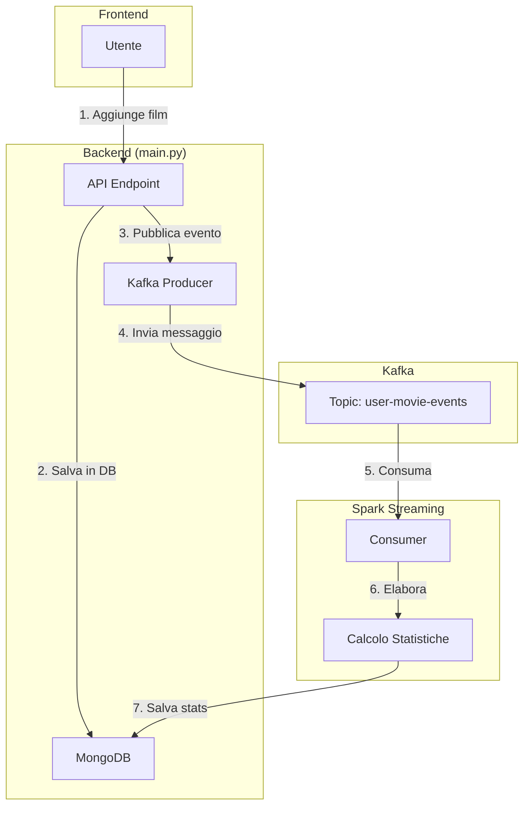
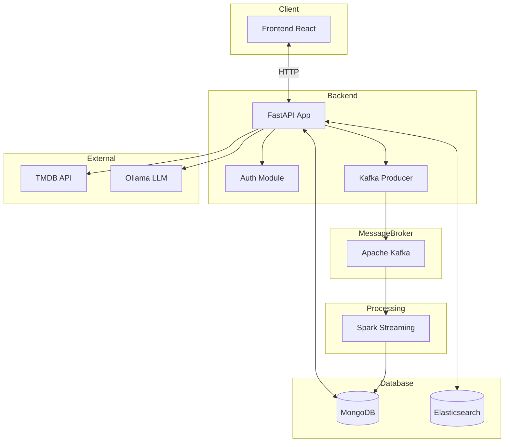
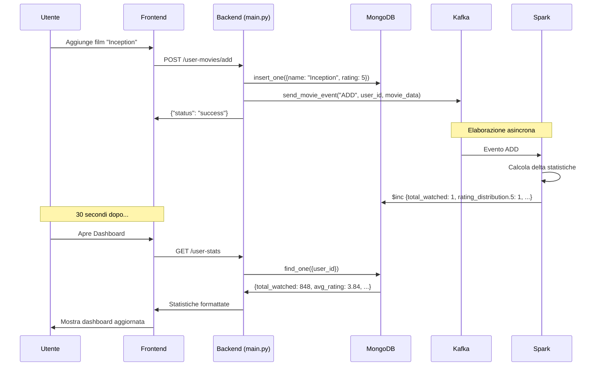
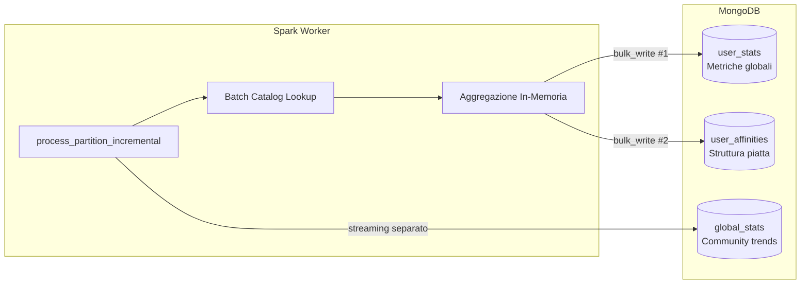
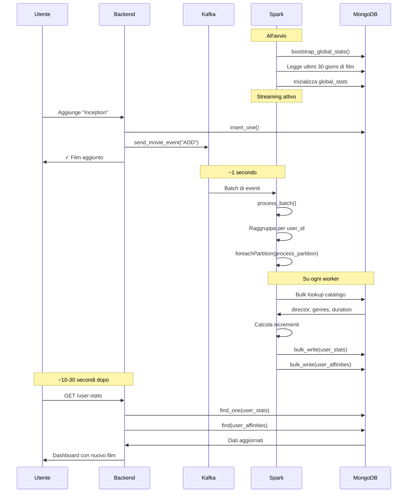

# Spiegazione Completa di `main.py`

Questo documento fornisce una spiegazione **accurata e completa** del file `main.py`, il cuore del backend di **CineMatch**. Ogni sezione viene analizzata in dettaglio, incluse le integrazioni con Kafka e il flusso degli eventi.

---

## 📚 Glossario dei Termini Tecnici

Prima di iniziare, ecco un glossario completo dei termini tecnici usati nel codice:

| Termine | Spiegazione |
|---------|-------------|
| **FastAPI** | Framework Python moderno per creare API REST ad alte prestazioni. Simile a Flask ma con supporto nativo per async/await e validazione automatica dei dati |
| **Endpoint** | Un URL specifico dell'API che risponde a richieste HTTP (es. `/login`, `/movies`). È il "punto di accesso" a una funzionalità |
| **CORS** | Cross-Origin Resource Sharing. Meccanismo di sicurezza che permette al frontend (su porta 5173) di comunicare col backend (su porta 8000) |
| **Middleware** | Codice che si esegue PRIMA o DOPO ogni richiesta HTTP. Usato qui per CORS e logging |
| **MongoDB** | Database NoSQL document-oriented. Invece di tabelle usa "collezioni" di documenti JSON |
| **Collection** | Equivalente di una "tabella" in MongoDB. Contiene documenti (record) |
| **Document** | Equivalente di una "riga" in database SQL. È un oggetto JSON con campi e valori |
| **ObjectId** | Identificatore unico generato automaticamente da MongoDB per ogni documento (simile a UUID) |
| **Pydantic** | Libreria per validazione dati. I modelli (come `UserAuth`) definiscono la struttura dei dati in ingresso |
| **BaseModel** | Classe base di Pydantic da cui ereditano tutti i modelli dati |
| **Depends** | Meccanismo FastAPI per dependency injection. Esegue funzioni prima dell'endpoint (es. autenticazione) |
| **HTTPException** | Modo standard per restituire errori HTTP (es. 404 Not Found, 401 Unauthorized) |
| **BackgroundTasks** | Sistema FastAPI per eseguire operazioni in background senza bloccare la risposta |
| **Scheduler** | Componente che esegue task automaticamente a orari prestabiliti (cron jobs) |
| **APScheduler** | Libreria Python per scheduling. `BackgroundScheduler` esegue job in thread separati |
| **Kafka** | Sistema di messaggistica distribuito. Permette comunicazione asincrona tra servizi |
| **Producer** | Componente che INVIA messaggi a Kafka (in questo caso, il backend) |
| **Consumer** | Componente che RICEVE messaggi da Kafka (in questo caso, Spark) |
| **Topic** | "Canale" Kafka su cui viaggiano i messaggi. Qui: `user-movie-events` |
| **Event** | Messaggio pubblicato su Kafka che descrive un'azione (ADD, DELETE, UPDATE_RATING, etc.) |
| **Spark** | Framework per elaborazione dati distribuiti. Qui usato per calcolare statistiche utente |
| **Lazy Loading** | Pattern che ritarda l'inizializzazione di risorse fino a quando non servono |
| **Singleton** | Pattern che garantisce una sola istanza di una classe nell'intera applicazione |
| **TMDB** | The Movie Database. API esterna per ottenere metadati film (poster, cast, trama) |
| **Elasticsearch** | Motore di ricerca full-text. Usato per ricerche avanzate nel catalogo film |
| **Aggregation Pipeline** | Query MongoDB avanzate che trasformano documenti in più step (come SQL con GROUP BY) |
| **Upsert** | Operazione che fa UPDATE se il documento esiste, INSERT se non esiste |
| **Cron** | Formato per specificare orari di esecuzione schedulata (es. "ogni giorno alle 01:00") |
| **JWT** | JSON Web Token. Standard per autenticazione stateless. Il token contiene info utente cifrate |
| **Hash** | Trasformazione irreversibile di una password in stringa sicura (non decifrabile) |
| **Normalization** | Processo di standardizzazione del testo (rimozione accenti, lowercase, ecc.) per matching |
| **Async/Await** | Paradigma Python per operazioni asincrone non-bloccanti |
| **Thread** | Unità di esecuzione parallela. Più thread possono eseguire codice contemporaneamente |
| **Threadpool** | Pool di thread riutilizzabili per eseguire operazioni bloccanti senza bloccare l'event loop |
| **Embedding** | Rappresentazione numerica (vettore) di testo/film usata per raccomandazioni ML |
| **FAISS** | Libreria Facebook per ricerca di similarità su vettori (usata per recommendations) |
| **Ollama** | Runtime locale per modelli LLM. Usato qui per generare domande quiz |

---

## 🏗️ Struttura del File

Il file `main.py` è organizzato in sezioni logiche:

```
main.py (~3000 righe)
│
├── 📦 Import e Configurazione (1-70)
├── 🚀 Startup Event e Scheduler (170-412)
├── 🔐 Auth Endpoints (420-600)
├── 🎬 Cinema Endpoints (610-1030)
├── 📊 Data & Stats Endpoints (1030-1600)
├── 🎯 Movies Endpoints (1600-2450)
├── 💬 Sentiment & Activity (2450-2510)
├── 📚 Catalog Endpoints (2510-2770)
├── 🔍 Elasticsearch Search (2630-2730)
├── 📈 Admin Stats (2770-2860)
└── 🧠 Quiz AI Endpoints (2860-3051)
```

---

## 1️⃣ Import e Configurazione (Linee 1-70)

### Dipendenze Principali

```python
from fastapi import FastAPI, UploadFile, File, Depends, HTTPException, status, BackgroundTasks
from fastapi.middleware.cors import CORSMiddleware
from pymongo import MongoClient
from kafka_producer import get_kafka_producer
```

| Import | Ruolo |
|--------|-------|
| `FastAPI` | Framework web principale |
| `CORSMiddleware` | Permette chiamate cross-origin dal frontend |
| `MongoClient` | Driver per connettersi a MongoDB |
| `get_kafka_producer` | Funzione per ottenere il producer Kafka singleton |

### Configurazione App

```python
app = FastAPI(
    title="CineMatch API",
    description="Sistema di raccomandazione film personalizzato",
    version="1.0.0"
)
```

### CORS Configuration

```python
app.add_middleware(
    CORSMiddleware,
    allow_origins=["http://localhost:5173", "http://127.0.0.1:5173"],
    allow_credentials=True,
    allow_methods=["*"],
    allow_headers=["*"],
)
```

> [!NOTE]
> CORS è necessario perché il frontend (React su porta 5173) e il backend (FastAPI su porta 8000) sono su origini diverse. Senza CORS, il browser bloccherebbe le richieste.

### Connessione Database

```python
MONGO_URL = os.getenv("MONGODB_URL", "mongodb://localhost:27017")
client = MongoClient(MONGO_URL)
db = client.cinematch_db

# Collections
users_collection = db.users
movies_collection = db.movies
movies_catalog = db.movies_catalog
stats_collection = db.user_stats
```

---

## 2️⃣ Startup Event (Linee 170-412)

### Cosa Succede all'Avvio dell'Applicazione

L'evento `@app.on_event("startup")` viene eseguito **una sola volta** quando il server si avvia.

```python
@app.on_event("startup")
async def startup_event():
```

### 2.1 Creazione Indici MongoDB

```python
users_collection.create_index("username", unique=True)
users_collection.create_index("user_id", unique=True)
movies_collection.create_index("user_id")
stats_collection.create_index("user_id", unique=True)
movies_catalog.create_index("normalized_title")
```

> [!IMPORTANT]
> Gli **indici** sono fondamentali per le performance. Senza indici, ogni query richiederebbe una scansione completa della collection.

### 2.2 Creazione Utente di Default

```python
if not default_user:
    users_collection.insert_one({
        "username": "pasquale.langellotti",
        "password": get_password_hash("Pasquale19!"),
        ...
    })
```

### 2.3 Scheduler per Task Automatici

```python
scheduler = BackgroundScheduler()
```

| Job | Orario | Funzione |
|-----|--------|----------|
| `movie_updater` | 01:00 | Aggiorna film nuovi da TMDB |
| `cinema_pipeline` | 00:00 | Scraping programmazione cinema |
| `embedding_update` | 00:30 | Aggiorna embeddings per ML |
| `quiz_generation` | 02:50 | Genera domande quiz con AI |

### 2.4 Caricamento CSV Iniziale

```python
csv_path = "/data/ratings.csv"
if os.path.exists(csv_path) and (not existing_stats or not has_data):
    # Carica film da CSV
    movies_collection.insert_many(movies)
    
    # RESET STATISTICHE
    stats_collection.delete_one({"user_id": user_id})
    
    # Pubblica su Kafka per Spark
    kafka_producer = get_kafka_producer()
    kafka_producer.send_batch_event("BULK_IMPORT", user_id, movies)
```

> [!CAUTION]
> Il **reset delle statistiche** prima del BULK_IMPORT è CRITICO. Senza reset, Spark sommerebbe i nuovi dati a quelli vecchi, causando conteggi doppi.

---

## 3️⃣ Flusso Kafka: Come Funziona l'Integrazione

Questa è la parte più importante da capire. Vediamo come ogni operazione sui film genera eventi Kafka.

### Diagramma del Flusso Completo



### Tipi di Eventi e Quando Vengono Generati

| Evento | Quando | Operazione MongoDB prima | Cosa fa Spark |
|--------|--------|--------------------------|---------------|
| `ADD` | Nuovo film aggiunto | `insert_one()` | Incrementa contatori (total_watched, genre_counts, rating_distribution, monthly_counts) |
| `DELETE` | Film rimosso | `delete_one()` | Decrementa contatori |
| `UPDATE_RATING` | Cambia solo rating | `update_one()` | Aggiorna sum_ratings e rating_distribution (old_rating → new_rating) |
| `BULK_IMPORT` | Upload CSV | `insert_many()` | Ricalcola tutto da zero |
| `RECALCULATE` | Richiesta manuale | Nessuna | Ricalcola tutto da zero |

---

## 4️⃣ Endpoint per Endpoint: Dove Kafka Viene Usato

### 4.1 POST `/movies` - Aggiunta Film Singolo (Linea 1664)

```python
@app.post("/movies")
async def add_movie(movie: MovieCreate, ...):
    # 1. Salva in MongoDB
    result = movies_collection.insert_one(entry)
    
    # 2. Aggiorna utente
    users_collection.update_one(...)
    
    # 3. Pubblica evento Kafka
    kafka_producer = get_kafka_producer()
    kafka_producer.send_movie_event("ADD", current_user_id, entry)
```

**Flusso:**
1. Il film viene salvato nella collection `movies`
2. Il flag `has_data` dell'utente viene settato a `True`
3. Un evento `ADD` viene pubblicato su Kafka
4. Spark riceve l'evento e incrementa le statistiche

### 4.2 POST `/user-movies/add` - Aggiunta da Catalogo (Linea 2175)

```python
@app.post("/user-movies/add")
async def add_movie_to_collection(movie: AddMovieRequest, ...):
    # Verifica se esiste già
    existing = movies_collection.find_one({...})
    
    if existing:
        # AGGIORNAMENTO: usa UPDATE_RATING se cambia il rating
        if old_rating != new_rating:
            kafka_producer.send_movie_event("UPDATE_RATING", current_user_id, {
                "old_rating": old_rating,
                "new_rating": new_rating
            })
    else:
        # NUOVO: usa ADD
        movies_collection.insert_one(new_movie)
        kafka_producer.send_movie_event("ADD", current_user_id, new_movie)
```

> [!TIP]
> La differenziazione tra `ADD` e `UPDATE_RATING` è fondamentale per evitare duplicazioni. Se un film esiste già e cambia solo il rating, NON dobbiamo incrementare `total_watched`.

### 4.3 POST `/user-movies/remove` - Rimozione Film (Linea 2316)

```python
@app.post("/user-movies/remove")
async def remove_movie_from_collection(movie: RemoveMovieRequest, ...):
    # 1. Recupera dati COMPLETI PRIMA di eliminare
    existing_movie = movies_collection.find_one({...})
    
    # 2. Elimina
    movies_collection.delete_one({"_id": existing_movie["_id"]})
    
    # 3. Pubblica DELETE con tutti i dati necessari
    kafka_producer.send_movie_event("DELETE", current_user_id, {
        "name": existing_movie.get("name"),
        "year": existing_movie.get("year"),
        "rating": existing_movie.get("rating"),  # Necessario per rating_distribution
        "date": existing_movie.get("date")       # Necessario per monthly_counts
    })
```

> [!WARNING]
> È ESSENZIALE recuperare i dati del film **PRIMA** di eliminarlo. Senza `rating` e `date`, Spark non potrebbe decrementare i contatori corretti.

### 4.4 PUT `/user-movies/update-rating` - Aggiornamento Rating (Linea 2361)

```python
@app.put("/user-movies/update-rating")
async def update_movie_rating(movie: UpdateMovieRequest, ...):
    # 1. Recupera film esistente per old_rating
    existing = movies_collection.find_one({...})
    old_rating = existing.get("rating")
    
    # 2. Aggiorna in MongoDB
    movies_collection.update_one(...)
    
    # 3. Pubblica UPDATE_RATING con delta
    kafka_producer.send_movie_event("UPDATE_RATING", current_user_id, {
        "old_rating": old_rating,
        "new_rating": new_rating
    })
```

**Cosa fa Spark con UPDATE_RATING:**
```python
# Spark (pseudocodice)
rating_distribution[old_rating] -= 1
rating_distribution[new_rating] += 1
sum_ratings += (new_rating - old_rating)
# total_watched rimane invariato!
```

### 4.5 POST `/upload-csv` - Caricamento Bulk (Linea 1087)

```python
@app.post("/upload-csv")
async def upload_csv(file: UploadFile, ...):
    # 1. Parsing CSV
    df = pd.read_csv(io.BytesIO(contents))
    
    # 2. Salva film (replace totale)
    movies_collection.delete_many({"user_id": current_user_id})
    movies_collection.insert_many(movies)
    
    # 3. RESET STATISTICHE (CRITICO!)
    stats_collection.delete_one({"user_id": current_user_id})
    db.user_affinities.delete_many({"user_id": current_user_id})
    
    # 4. Pubblica BULK_IMPORT
    kafka_producer.send_batch_event("BULK_IMPORT", current_user_id, movies)
```

> [!CAUTION]
> Il **RESET delle statistiche** prima del BULK_IMPORT è OBBLIGATORIO. Spark usa operazioni `$inc` (incrementali) quindi senza reset si avrebbero conteggi doppi.

### 4.6 POST `/recalculate-stats` - Ricalcolo Manuale (Linea 1230)

```python
@app.post("/recalculate-stats")
async def recalculate_stats(current_user_id: str = Depends(get_current_user_id)):
    movies = list(movies_collection.find({"user_id": current_user_id}))
    
    # RESET STATISTICHE
    stats_collection.delete_one({"user_id": current_user_id})
    db.user_affinities.delete_many({"user_id": current_user_id})
    
    # Pubblica RECALCULATE
    kafka_producer.send_batch_event("RECALCULATE", current_user_id, movies)
```

---

## 5️⃣ Lettura Statistiche: L'Altro Lato del Flusso

### GET `/user-stats` (Linea 1290)

Questo endpoint legge le statistiche CALCOLATE da Spark e le formatta per il frontend.

```python
@app.get("/user-stats")
async def get_user_stats(current_user_id: str = Depends(get_current_user_id)):
    # 1. Leggi da user_stats (scritto da Spark)
    stats = stats_collection.find_one({"user_id": current_user_id})
    
    # 2. Sync real-time del conteggio (fonte di verità: movies collection)
    total_watched = movies_collection.count_documents({"user_id": current_user_id})
    
    # 3. Leggi directors/actors/genres da user_affinities
    affinities_collection = db.user_affinities
    directors_cursor = affinities_collection.find({
        "user_id": current_user_id, 
        "type": "director"
    }).sort("count", -1).limit(50)
```

### Schema delle Statistiche (V6)

```javascript
// Collection: user_stats
{
    "user_id": "pasquale.langellotti",
    "total_watched": 847,           // Calcolato da Spark
    "sum_ratings": 3245,            // Somma di tutti i rating
    "watch_time_minutes": 102450,   // Minuti totali
    "rating_distribution": {        // Distribuzione rating
        "1": 23, "2": 45, "3": 156, "4": 312, "5": 311
    },
    "monthly_counts": {             // Film per mese/anno
        "2024": {"01": 12, "02": 8, ...},
        "2025": {"01": 15, ...}
    },
    "genre_counts": {               // Film per genere
        "Drama": 234, "Comedy": 178, ...
    },
    "stats_version": "6.0_flat_affinities",
    "updated_at": "2026-01-22T12:00:00+01:00"
}

// Collection: user_affinities (struttura piatta V6)
{
    "user_id": "pasquale.langellotti",
    "type": "director",             // o "actor" o "genre"
    "name_key": "Christopher_Nolan",
    "name": "Christopher Nolan",
    "count": 8,                     // Film visti
    "sum_voti": 38                  // Somma rating
}
```

---

## 6️⃣ Altri Endpoint Importanti

### Cinema Endpoints (Linee 610-1030)

```python
@app.get("/cinema/films")
async def get_cinema_films(...):
    # Ottiene film in programmazione arricchiti col catalogo
    # Filtra film già visti dall'utente
```

### Recommendations (Linea 1625)

```python
@app.get("/recommendations")
async def get_recommendations(...):
    from recommendation_service import get_recommendation_service
    service = get_recommendation_service()
    result = await run_in_threadpool(service.get_recommendations, current_user_id)
```

### Quiz AI (Linee 2860-3051)

```python
@app.get("/quiz/questions")
async def get_quiz_questions(n: int = 5):
    # Restituisce domande generate da Ollama

@app.post("/quiz/submit")
async def submit_quiz_results(...):
    # Salva risultati e aggiorna statistiche quiz
```

---

## 7️⃣ Diagramma Completo dell'Architettura



---

## 8️⃣ Riepilogo del Flusso Kafka



---

## 9️⃣ Punti Chiave da Ricordare

> [!IMPORTANT]
> **Regola d'Oro #1**: Ogni operazione che modifica i film dell'utente DEVE pubblicare un evento Kafka.

> [!IMPORTANT]
> **Regola d'Oro #2**: Prima di BULK_IMPORT o RECALCULATE, SEMPRE resettare `user_stats` e `user_affinities`.

> [!IMPORTANT]
> **Regola d'Oro #3**: Per DELETE, recuperare i dati del film PRIMA di eliminarlo.

> [!IMPORTANT]
> **Regola d'Oro #4**: Usare UPDATE_RATING solo quando cambia il rating, non ADD (evita duplicazioni).

---

## 🔗 File Correlati

| File | Descrizione |
|------|-------------|
| [kafka_producer.py](file:///c:/Users/lange/Desktop/Esame-Fenza/backend/kafka_producer.py) | Producer Kafka con singleton pattern |
| [spark_stats_processor.py](file:///c:/Users/lange/Desktop/Esame-Fenza/backend/spark_stats_processor.py) | Consumer Spark che elabora gli eventi |
| [auth.py](file:///c:/Users/lange/Desktop/Esame-Fenza/backend/auth.py) | Gestione autenticazione JWT |
| [recommendation_service.py](file:///c:/Users/lange/Desktop/Esame-Fenza/backend/recommendation_service.py) | Sistema raccomandazioni con FAISS |
| [quiz_generator.py](file:///c:/Users/lange/Desktop/Esame-Fenza/backend/quiz_generator.py) | Generazione quiz con Ollama |
| [cinema_pipeline.py](file:///c:/Users/lange/Desktop/Esame-Fenza/backend/cinema_pipeline.py) | Scraping programmazione cinema |

---

## 🔥 Dettaglio del Processore Spark (`spark_stats_processor.py`)

Questa sezione spiega in profondità come Spark elabora gli eventi ricevuti da Kafka.

### Architettura V6: Flat Affinities

L'architettura attuale (versione 6.0) separa le metriche in due collezioni:



### Perché Struttura Piatta?

| Aspetto | V5 (Nidificata) | V6 (Piatta) |
|---------|-----------------|-------------|
| **Documento user_stats** | 100KB+ (con tutti directors/actors) | ~5KB (solo metriche) |
| **Query per "migliori registi"** | Aggregation Pipeline complessa | `find({type: "director"}).sort({count: -1})` |
| **Tempo di write** | 500ms+ per documento grande | 10-50ms per bulk piccolo |
| **Scalabilità** | Limite 16MB per documento | Illimitata |

### La Funzione `process_partition_incremental`

Questa è la funzione core che viene eseguita **in parallelo** su ogni worker Spark:

```python
def process_partition_incremental(iterator):
    """
    Eseguita in parallelo su ogni partizione Spark.
    Ogni partizione contiene eventi di N utenti.
    """
    
    # 1. BATCH LOOKUP CATALOGO
    # Invece di fare N query (una per film), facciamo UNA query con $in
    all_titles = {event.name for event in all_events}
    catalog_docs = db.movies_catalog.find({
        "$or": [
            {"title": {"$in": list(all_titles)}},
            {"normalized_title": {"$in": normalized_titles}}
        ]
    })
    catalog_map = {d["title"]: d for d in catalog_docs}
    
    # 2. AGGREGAZIONE IN-MEMORIA
    # Accumula tutti gli incrementi prima di scrivere
    user_stats_inc = {}       # {user_id: {field: delta}}
    user_affinities_inc = {}  # {affinity_id: {count, sum_voti}}
    
    for event in events:
        delta = -1 if "DELETE" in event.event_type else 1
        
        # Accumula per user_stats
        user_stats_inc[user_id]["total_watched"] += delta
        user_stats_inc[user_id]["sum_ratings"] += rating * delta
        user_stats_inc[user_id][f"monthly_counts.{year}.{month}"] += delta
        
        # Accumula per user_affinities (directors, actors, genres)
        for director in directors_list:
            affinity_id = f"{user_id}_director_{director_key}"
            user_affinities_inc[affinity_id]["count"] += delta
            user_affinities_inc[affinity_id]["sum_voti"] += rating * delta
    
    # 3. BULK WRITE (una operazione per collezione)
    db.user_stats.bulk_write([
        UpdateOne({"user_id": uid}, {"$inc": increments})
        for uid, increments in user_stats_inc.items()
    ])
    
    db.user_affinities.bulk_write([
        UpdateOne({"_id": aid}, {"$inc": data, "$set": metadata})
        for aid, data in user_affinities_inc.items()
    ])
```

### Gestione UPDATE_RATING

Quando un utente cambia solo il rating di un film esistente:

```python
if is_update_rating:
    old_rating = event.old_rating
    new_rating = event.new_rating
    
    stats_inc = {
        # Sposta da distribuzione vecchia a nuova
        f"rating_distribution.{old_rating}": -1,
        f"rating_distribution.{new_rating}": +1,
        
        # Aggiorna somma (delta)
        "sum_ratings": new_rating - old_rating
    }
    
    # NOTA: total_watched NON viene toccato!
    # NOTA: monthly_counts NON viene toccato!
    
    # Per affinities: aggiorna solo sum_voti
    for affinity in related_affinities:
        affinity["sum_voti"] += (new_rating - old_rating)
        # count resta invariato
```

### Flusso Temporale Completo



### Due Stream Paralleli in Spark

Spark esegue **due stream contemporaneamente**:

| Stream | Funzione | Trigger | Collezione Target |
|--------|----------|---------|-------------------|
| **User Stats** | `process_batch()` | Ogni 5 secondi | `user_stats` + `user_affinities` |
| **Global Trends** | `write_global_trends_to_mongo()` | Ogni 2 minuti | `global_stats` |

```python
# stream 1: statistiche utente
user_stats_query = parsed_stream.writeStream \
    .foreachBatch(process_batch) \
    .trigger(processingTime="5 seconds") \
    .start()

# stream 2: trend globali community
global_trends_query = aggregated \
    .writeStream \
    .foreachBatch(write_global_trends_to_mongo) \
    .trigger(processingTime="2 minutes") \
    .start()
```

### Bootstrap all'Avvio

Prima di iniziare lo streaming, Spark esegue un **bootstrap** per inizializzare `global_stats`:

```python
def bootstrap_global_stats():
    """
    Legge TUTTI i film degli ultimi 30 giorni da MongoDB
    e inizializza i contatori base per global_stats.
    Lo streaming poi aggiornerà in modo incrementale.
    """
    
    # 1. Leggi film recenti
    recent_movies = db.movies.find({
        "date": {"$gte": thirty_days_ago}
    })
    
    # 2. Conta film e generi
    movie_counts = Counter()
    genre_counts = Counter()
    
    for movie in recent_movies:
        movie_counts[movie["name"]] += 1
        for genre in movie.get("genres", []):
            genre_counts[genre] += 1
    
    # 3. Salva stato iniziale
    db.global_stats.update_one(
        {"type": "global_trends"},
        {"$set": {
            "top_movies": [top 10 più visti],
            "trending_genres": [top 10 generi],
            "movie_counts": dict(movie_counts),  # Per merge streaming
            "genre_counts": dict(genre_counts),
            "source": "bootstrap"
        }},
        upsert=True
    )
```

---

## 📊 Riepilogo Collezioni MongoDB

| Collezione | Scritta da | Letta da | Scopo |
|------------|------------|----------|-------|
| `movies` | Backend | Backend, Spark | Film visti dall'utente |
| `movies_catalog` | Backend (TMDB) | Backend, Spark | Metadati film (poster, cast, ecc.) |
| `user_stats` | Spark | Backend | Statistiche aggregate utente |
| `user_affinities` | Spark | Backend | Conteggi per director/actor/genre |
| `global_stats` | Spark | Backend | Trend community (top film, generi) |
| `users` | Backend | Backend | Account utente |

