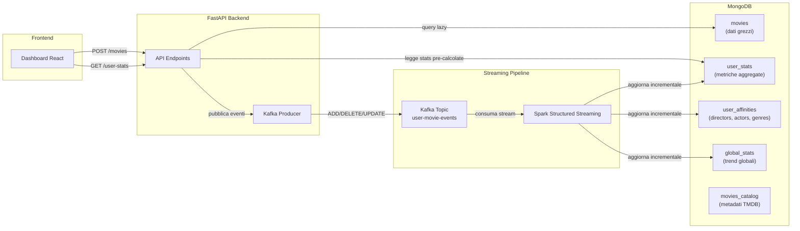
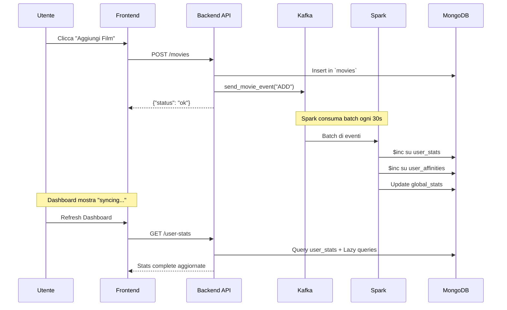

# 📊 Architettura Dati della Dashboard CineMatch

Questo documento spiega in dettaglio come la dashboard produce i dati, distinguendo tra dati calcolati **Lazy** (on-demand) e dati elaborati con **Spark Streaming**.

---

## 🏗️ Architettura Generale



---

## 🔥 Kafka: Il Sistema di Messaggistica

### Cosa fa Kafka?
Kafka è il **message broker** che collega il backend API con Spark. Ogni volta che un utente:
- 📥 **Aggiunge** un film → evento `ADD`
- ✏️ **Modifica** un rating → evento `UPDATE_RATING`
- 🗑️ **Elimina** un film → evento `DELETE`
- 📤 **Importa CSV** → eventi `BULK_IMPORT` (uno per film)

### Schema Evento Kafka

```json
{
  "event_type": "ADD",
  "user_id": "user123",
  "movie": {
    "name": "Inception",
    "year": 2010,
    "rating": 5,
    "genres": ["Sci-Fi", "Thriller"],
    "director": "Christopher Nolan",
    "actors": "Leonardo DiCaprio, Tom Hardy",
    "date": "2026-01-21"
  },
  "timestamp": "2026-01-21T20:00:00+01:00"
}
```

### Produttore Kafka (`kafka_producer.py`)

| Metodo | Descrizione |
|--------|-------------|
| `send_movie_event()` | Invia singolo evento (ADD/DELETE/UPDATE) |
| `send_batch_event()` | Invia batch di eventi (BULK_IMPORT/RECALCULATE) |

> [!NOTE]
> La connessione Kafka è **lazy**: viene creata solo al primo evento, non al boot.

---

## ⚡ Spark Structured Streaming: L'Elaboratore

### Cosa fa Spark?
Spark è il **cuore del processing** che trasforma gli eventi grezzi in statistiche aggregate. Opera in due modalità:

### 1️⃣ Statistiche Utente (Micro-Batch O(1))

| Campo Aggiornato | Operazione |
|------------------|------------|
| `total_watched` | `$inc: +1` o `-1` |
| `sum_ratings` | `$inc: +rating` o `-rating` |
| `watch_time_minutes` | `$inc: +duration` |
| `rating_distribution.{1-5}` | `$inc: +1` o `-1` |
| `monthly_counts.{YYYY}.{MM}` | `$inc: +1` o `-1` |

**Collezioni aggiornate:**
- `user_stats` → metriche globali utente
- `user_affinities` → registi, attori, generi preferiti (struttura piatta)

### 2️⃣ Global Trends (Streaming Incrementale)

| Campo | Descrizione |
|-------|-------------|
| `top_movies` | Top 10 film più visti da tutti gli utenti |
| `trending_genres` | Generi più popolari (ultimi 30 giorni) |
| `movie_counts` | Conteggio raw per ogni titolo |
| `genre_counts` | Conteggio raw per ogni genere |

**Meccanismo:**
1. **Bootstrap** iniziale: legge TUTTI i film storici (ultimi 30gg) all'avvio
2. **Streaming**: aggiorna incrementalmente ad ogni batch (trigger: 2 minuti)

```python
# Da spark_stats_processor.py
global_trends_query = aggregated \
    .writeStream \
    .foreachBatch(write_global_trends_to_mongo) \
    .outputMode("update") \
    .trigger(processingTime="2 minutes")
```

### 3️⃣ Cosa fa Spark OLTRE il semplice `$inc`?

Spark non esegue solo incrementi. Ecco il **processing completo** per ogni evento:

#### A. Arricchimento dal Catalogo (JOIN)
```python
# Batch lookup nel catalogo MongoDB
catalog_docs = list(db.movies_catalog.find({
    "$or": [
        {"title": {"$in": all_titles_list}},
        {"normalized_title": {"$in": normalized_titles_list}}
    ]
}))

# Costruisce mappa titolo → metadati
for d in catalog_docs:
    catalog_map[d.get('title')] = d
```

#### B. Estrazione Registi/Attori
```python
catalog_info = catalog_map.get(title)
director_str = catalog_info.get("director", "")   # "Christopher Nolan"
actors_str = catalog_info.get("actors", "")       # "Leonardo DiCaprio, Tom Hardy, ..."
genres = catalog_info.get("genres", [])           # ["Sci-Fi", "Thriller"]
duration = catalog_info.get("duration", 0)        # 148 minuti
```

#### C. Parsing e Splitting
```python
# Split registi (alcuni film hanno più registi)
directors_list = [d.strip() for d in re.split(r'[,|]', director_str)]

# Split attori (primi 15 per film)
actors_list = [a.strip() for a in re.split(r'[,|]', actors_str)][:15]
```

#### D. Bulk Write Multi-Collezione
```python
# COLLEZIONE 1: user_stats (metriche globali)
db.user_stats.bulk_write([
    UpdateOne({"user_id": user_id}, {"$inc": {
        "total_watched": 1,
        "sum_ratings": 5,
        "watch_time_minutes": 148,
        "rating_distribution.5": 1,
        "monthly_counts.2026.01": 1
    }})
])

# COLLEZIONE 2: user_affinities (un documento per entità)
db.user_affinities.bulk_write([
    UpdateOne({"_id": "user123_director_Christopher_Nolan"}, 
              {"$inc": {"count": 1, "sum_voti": 5}}),
    UpdateOne({"_id": "user123_actor_Leonardo_DiCaprio"}, 
              {"$inc": {"count": 1, "sum_voti": 5}}),
    # ... altri 14 attori ...
    UpdateOne({"_id": "user123_genre_Sci-Fi"}, 
              {"$inc": {"count": 1}})
])
```

> [!IMPORTANT]
> **Senza Spark**, dovresti fare tutto questo **on-demand** ad ogni GET. Con 500 film utente e 15 attori per film = **7500+ operazioni** per ogni refresh della dashboard!

---

## 🍃 MongoDB: Il Data Store

### Collezioni Principali

| Collezione | Scopo | Popolata da |
|------------|-------|-------------|
| `movies` | Film visti utente (dati grezzi) | API Backend (diretto) |
| `movies_catalog` | Metadati TMDB (poster, generi, cast) | CSV Import + TMDB API |
| `user_stats` | Statistiche aggregate utente | **Spark** (incrementale) |
| `user_affinities` | Registi/Attori/Generi preferiti | **Spark** (incrementale) |
| `global_stats` | Trend globali piattaforma | **Spark** (bootstrap + streaming) |
| `users` | Profili utente, quiz stats | API Backend (diretto) |

### Struttura `user_affinities` (V6 - Piatta)

```json
{
  "_id": "user123_director_Christopher_Nolan",
  "user_id": "user123",
  "type": "director",
  "name": "Christopher Nolan",
  "name_key": "Christopher_Nolan",
  "count": 5,
  "sum_voti": 23,
  "updated_at": "2026-01-21T20:00:00+01:00"
}
```

> [!TIP]
> Questa struttura piatta è **10-100x più veloce** rispetto ai documenti nidificati. Query come "top 10 registi" diventano semplici: `find({user_id, type: "director"}).sort({count: -1}).limit(10)`

---

## ⏳ Dati Lazy vs Dati Spark

### 🐢 Dati LAZY (On-Demand)

Questi dati vengono **calcolati al momento della richiesta** direttamente dalla collezione `movies`:

| Dato | Endpoint | Query MongoDB |
|------|----------|---------------|
| Top Rated Movies | `/user-stats/top-rated` | `movies.find({rating: {$gte: 4}}).sort({rating: -1})` |
| Recent Movies | `/user-stats/recent` | `movies.find().sort({date: -1}).limit(10)` |
| Monthly Stats (anno corrente) | `/monthly-stats/{year}` | Aggregazione con `$group` per mese |
| Film per Regista/Attore | `/movies/person` | Arricchimento + filtro su catalogo |
| Total Watched Count | `/user-stats` | `movies.count_documents({user_id})` |

**Perché Lazy?**
- ✅ **Sempre aggiornati** al 100% (fonte di verità)
- ✅ Evitano problemi di sincronizzazione
- ⚠️ Query leggermente più lente (ma con indici ottimali sono ~10ms)

### ⚡ Dati SPARK (Pre-calcolati)

Questi dati sono **calcolati incrementalmente** da Spark e letti da `user_stats` / `user_affinities`:

| Dato | Collezione | Aggiornamento |
|------|------------|---------------|
| Rating Distribution (1-5 stelle) | `user_stats` | Ogni batch Spark (~30s) |
| Watch Time (ore totali) | `user_stats` | Ogni batch Spark |
| Monthly Counts (anni passati) | `user_stats` | Ogni batch Spark |
| Best Rated Directors | `user_affinities` | Ogni batch Spark |
| Most Watched Directors | `user_affinities` | Ogni batch Spark |
| Best Rated Actors | `user_affinities` | Ogni batch Spark |
| Most Watched Actors | `user_affinities` | Ogni batch Spark |
| Genre Distribution | `user_affinities` | Ogni batch Spark |
| Global Top 10 Movies | `global_stats` | Ogni 2 minuti |
| Trending Genres | `global_stats` | Ogni 2 minuti |

**Perché Spark?**
- ✅ **Calcoli complessi** (aggregazioni cross-catalog)
- ✅ **Scalabilità** (milioni di eventi processati in parallelo)
- ✅ **Real-time** ma efficiente (batch ogni 30s, non per ogni singolo evento)

---

## 🔄 Flusso Completo: Aggiunta Film



---

## 📊 Indicatore Sync Status

La dashboard mostra lo stato di sincronizzazione:

| Status | Significato |
|--------|-------------|
| ✅ `synced` | Stats Spark aggiornate con ultimi dati |
| 🔄 `syncing` | Utente ha modificato dati, Spark sta processando |

**Logica:**
```python
if user.data_updated_at > stats.updated_at:
    sync_status = "syncing"
else:
    sync_status = "synced"
```

---

## 🎯 Riepilogo Architettura

| Componente | Ruolo |
|------------|-------|
| **Kafka** | Disaccoppia API da processing. Garantisce delivery eventi. |
| **Spark** | Elabora stream, calcola aggregazioni incrementali O(1). |
| **MongoDB** | Persiste dati grezzi (`movies`) e pre-calcolati (`user_stats`). |
| **API Backend** | Orchestratore: scrive in MongoDB, pubblica su Kafka, serve dati lazy + cached. |
| **Dashboard** | Consuma API, mostra stats pre-calcolate con lazy-loading per dettagli. |

> [!IMPORTANT]
> Il sistema è **ibrido**: usa dati pre-calcolati da Spark per velocità, ma **sincronizza in real-time** i conteggi critici (total_watched, monthly current year) direttamente dalla collection `movies` per garantire consistenza al 100%.
